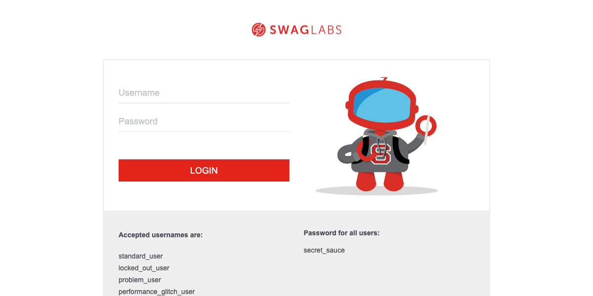
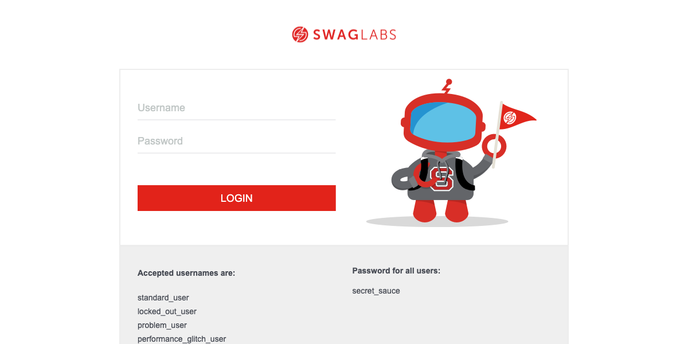
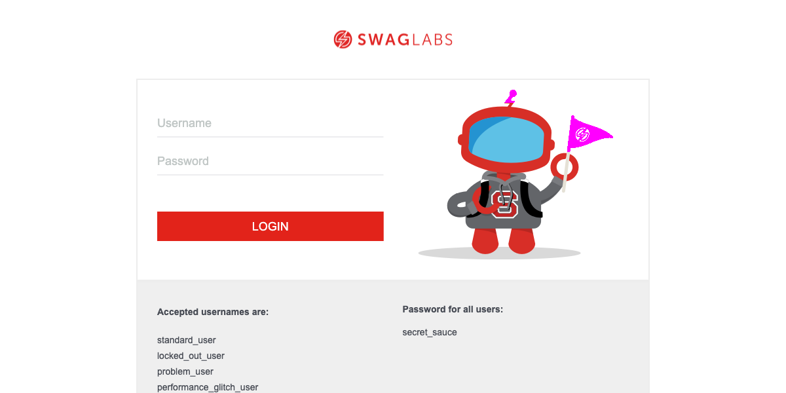

# **codeceptjs-web-POC**
This project is a proof of concept implementation of using codeceptJS for performing functional (UI) testing of web apps using Puppeteer.

CodeceptJS (https://codecept.io/) is a platform agnostic testing framework that can automate testing against web apps, hybrid apps, and native mobile apps. It can also execute tests against simulators, real devices, and via cloud based device providers such as SauceLabs, Browserstack, and Perfecto.  

The syntax of tests for codeceptJS is extremely simple and approachable, and is consistent across testing targets, e.g. the same test syntax is used to test everything from web to native apps, which means that a person learning to write tests for one platform can easily transport their skills for testing against another.

**Note:** This project is specifically intended to enable **web** applications.  For testing native applications on Android and iOS, see the project [codeceptJS-native-POC](https://github.com/ttupper92618/codeceptjs-native-POC).

## **Things this Project Does**

This project provides a number of features, including the following:

- Web application testing
- Reporting via XML
- Reporting via HTML
- Reporting via JSON
- Reporting integration with the Allure reporting dashboard
- Visual testing (comparing views at run-time with a baseline image representing design)
- Automatic screen-shots on failed tests
- Simple JS based tests with an approachable syntax
- BDD style testing via Cucumber and Gherkin features

## **Getting Started**

### **Nerd Note**

This readme is written with n00bs in mind.  As a result, it exhaustively covers setup including all necessary dependencies.  It assumes zero preparation, so includes steps for doing things like:

- Installing homebrew
- Installing node and npm

Feel free to skip any steps you have already satisfied, but please recognize that unless all of them are satisfied, this project will not successfully execute tests.

### **Install Homebrew**

Before installing, you need to have node installed on your system.  For macs, this can be most easily accomplished using homebrew.  If you don't have homebrew installed on your system, you may do so by pasting this into terminal:

```
/bin/bash -c "$(curl -fsSL https://raw.githubusercontent.com/Homebrew/install/HEAD/install.sh)"
```

### **Install Node and NPM**

Once you have installed brew, you can install node.  To do so, make sure brew is updated to the latest by typing the following command in terminal:

```
brew update
```

Then type the following into terminal in order to install node:

```
brew install node
```

When the process completes, you can test node and NPM by typing the following commands into terminal:

```
node -v
```
```
npm -v
```

Having done this, you should see version strings for each in response to the command entered.

### **Clone the Repo**

Having completed all of the foregoing steps, it is time to clone the repo.  To do so, type the following in terminal:

```
git clone https://github.com/ttupper92618/codeceptjs-web-POC.git
```

**Note** that you should only do this from the location where you want this project to be installed.  

### **Install Dependencies**

This project has a number of dependencies.  You must install these before you can execute tests.  To do so, first CD into the cloned repo:

```
cd codeceptjs-web-POC
```

Then execute the following:

```
npm i
```

### **Executing Tests**

If you have successfully executed all of the previous steps, you should now be able to execute tests by issuing this command in terminal:

```
npm run web
```

Note that you must execute this from within the '**codeceptjs-web-POC**' directory.

If you watch your screen, having executed the above command, you should be able to see a web browser spin up, and you should be able to watch the tests execute in real time.  When the tests complete running, you should see an execution summary in your terminal:


### **Reporting**

One of codeceptJS's numerous capabilities is the ability to do flexible reporting.  One of these reporting mechanisms is integration with Allure, an open source reporting dashboard that provided graphical, easy to use reports.  To view reports using allure, execute the following from your terminal:

```
allure serve output
```

Having done so, you should see allure open in your default web browser, as seen below.  Feel free to navigate around Allure's section - there are too many great features to cover here.


In addition to allure, this project will also produce XML reports for each test case, and also produces an HTML report.  The XML reports are located in the '**output**' directory within the project, and the HTML report (see example below) can be found in the '**mochawesome-report**' directory.


### **Visual Testing**

This project enables visual testing through resemble.js.  Resemble.js is an image comparison tool that can compare two images and produce a diff image that highlights the differences between the two images. It can be configured to ignore differences under a given threshold, and when tests fail, the base, capture, and diff images are provided through this project's reporting processes.  You can include visual testing in any test case simply by taking a screen capture and then comparing it to a base image, like so:

```
I.saveScreenshot('login_view_web.png');
I.seeVisualDiff('login_view_web.png', {tolerance: 0});
```

To see how this works, one of the sample tests in this project will intentionally fail.  Based on the following base image, it will capture the login view, and produce a diff as seen below:

| Base Image            | Screen Capture        | Diff                  |
| --------------------- | --------------------- | --------------------- |
|  |  |  |

Notice how the diff image highlights (in magenta) the areas that differ between the base and capture images.
